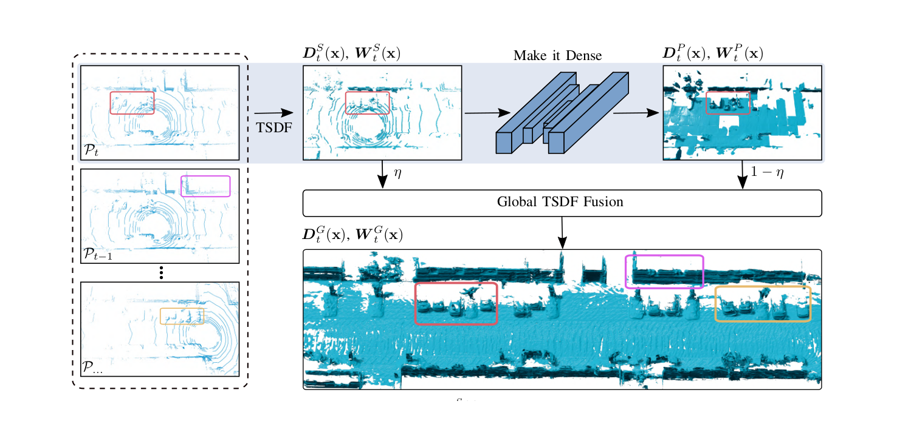

# Make it Dense: Self-Supervised Geometric Scan Completion of Sparse 3D LiDAR Scans in Large Outdoor Environments


This repository contains the implementation of the following publication:

```bibtex
@article{vizzo2022ral,
  author  = {I. Vizzo and B. Mersch and R. Marcuzzi and L. Wiesmann and and J. Behley and C. Stachniss},
  title   = {{Make it Dense: Self-Supervised Geometric Scan Completion of Sparse 3D LiDAR Scans in Large Outdoor Environments}},
  journal = {IEEE Robotics and Automation Letters (RA-L)},
  year    = 2022
}
```

## Overview


_A TSDF-based surface model from a single 16-beam LiDAR scan (left) turned into
a denser, completed TSDF-based surface model (right) by the learning-based
approach proposed in this paper._



_Overview of our approach. We first generate a TSDF volume of a single scan. We
then apply our geometric scan completion network in a strided fashion, such that
missing values are added to the single-scan TSDF, giving a more complete TSDF
volume. The predicted TSDF values are then used to update the global TSDF
representation using a weighting term `η` to avoid integrating the same
observation twice into the map._

## Table of Contents

- [Installation](#installation)
  - [Instal `OpenVDB`](#instal-openvdb)
  - [Install `vdb_to_numpy`](#install-vdb_to_numpy)
  - [Install `vdbfusion`](#install-vdbfusion)
  - [Install `make_it_dense`](#install-make_it_dense)
  - [Install `torch`](#install-torch)
- [Data](#data)
- [Training](#training)
  - [Precache](#precache)
  - [Inspecting cached models](#inspecting-cached-models)
  - [Train](#train)
- [Testing](#testing)
  - [Single Scan Test](#single-scan-test)
  - [Test Refusion Pipeline](#test-refusion-pipeline)

## Installation

### Instal `OpenVDB`

You will need to install the library from [source](https://www.openvdb.org/documentation/doxygen/build.html), I would also reccomend to use my own [fork](https://github.com/nachovizzo/openvdb) until I found a solution for [#1096](https://github.com/AcademySoftwareFoundation/openvdb/issues/1096), if you have all dependencies installed just:

```sh
git clone https://github.com/nachovizzo/openvdb.git -b nacho/fix_background_inactive \
  && cd openvdb \
  && mkdir build && cd build \
  && cmake -DOPENVDB_BUILD_PYTHON_MODULE=ON -DUSE_NUMPY=ON .. \
  && sudo make -j$(nproc) all install 
```

### Install `vdb_to_numpy`

We need this small library to convert our VDB volumes to numpy arrays, and use the data for training.


```sh
git clone https://github.com/PRBonn/vdb_to_numpy \
    && cd vdb_to_numpy \
    && pip install .
```

### Install `vdbfusion`

We need to install this library from the source, not from the pip package. All the details are in the [INSTALL.md](https://github.com/PRBonn/vdbfusion/blob/main/INSTALL.md), but basically:

```sh
git clone https://github.com/PRBonn/vdbfusion.git \
    && cd vdbfusion \
    && pip install .
```

### Install `make_it_dense`
On the root of this repository do `pip install .`

### Install `torch`

I do not enforce any particular version of PyTorch, make sure it is not extremely old and that it has CUDA support

## Data

We use the KITTI Odometry dataset, download it and place it in the `data/` folder. If you don't want to do so, you can also change the path in the [config/kitti.yaml](config/kitti.yaml) file.

## Training

To reproduce the results of the paper, you can use sequence `07` from KITTI to train the network

### Precache

To speed up training it is recommended to first cache all the vdb-grids, for there is a handy script that will do it for you:

```sh
./apps/precache.py -s 07
```

This will take some time but will save a lot in the future

### Inspecting cached models

To make sure everything is OK I would advise you to also inspect the VDB models you generate for training:


```sh
./apps/dump_training_data.py -s 07
```

This will output all the vdbs that will be used for training following this structure:
```sh
├── gt
│   ├── gt_tsdf_10
│   ├── gt_tsdf_20
│   └── gt_tsdf_40
└── tsdf
```

To visually inspect the models, go to one directory and run `vdb_view *.vdb`, using the arrows you can navigate the OpenVDB visualizer and see all the models.

### Train

Training should now be straight-forward:
```sh
./apps/train.py --config config/kitti.yaml
```

## Testing

To test the network you can use your trained model or use the default one in [models](./models/). There are 2 entry points to test the network:

### Single Scan Test

To test how the network behaves with just 1 scan (use any point-cloud you wish):
```sh
./apps/test_scan.py --cuda  $DATASETS/kitti-odometry/dataset/sequences/00/velodyne/000000.bin 
```

### Test Refusion Pipeline

To test the full pipeline when using a 16-beam LiDAR you can use the following command:
```sh
./apps/refusion_pipeline.py --sequence 00 -n 30 --visualize
```

